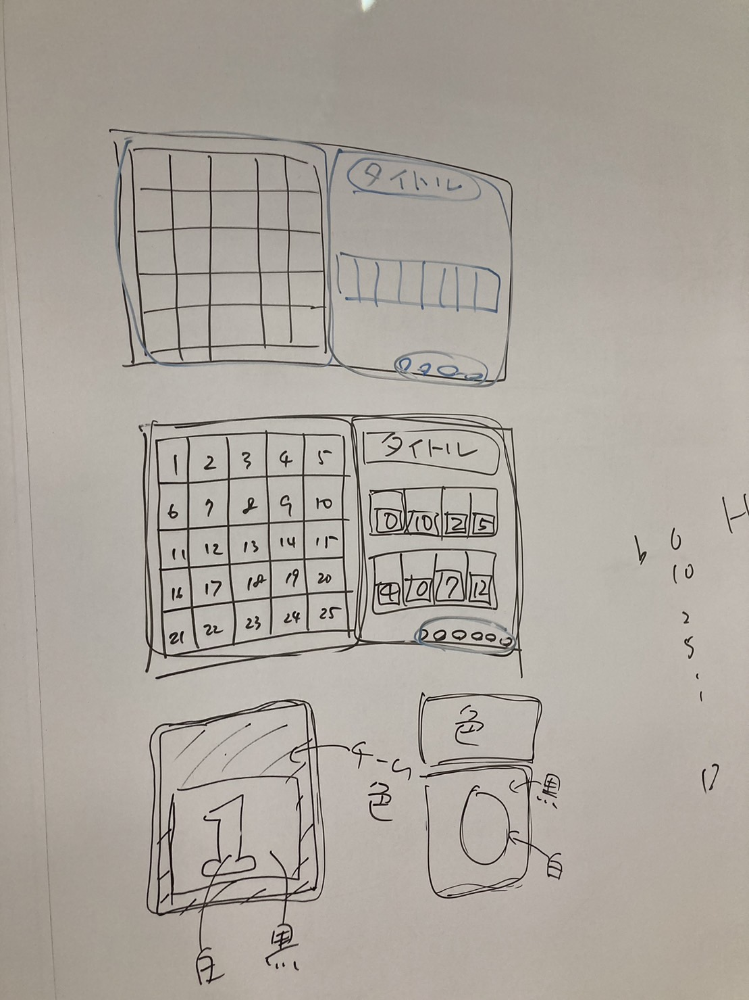
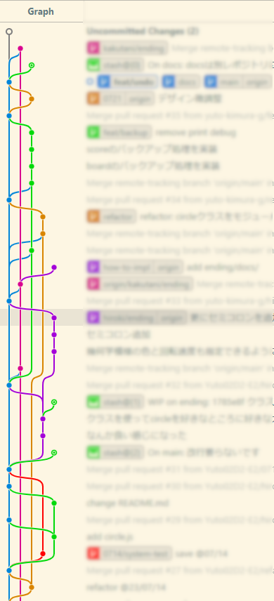

## 1. はじめに
このページでは，開発者裏側として，アプリ開発の流れなどを紹介します．

## 2. プロジェクトメンバー
[甲南大学 知能情報学部](https://www.konan-u.ac.jp/faculty/ii/) が主催する，[スーパーIT人材育成プロジェクト｜競技プログラミング勉強会](https://www.konan-u.ac.jp/hp/seki/premier/icpc) に参加しているメンバーと，
オープンキャンパススタッフを小出先生が繋げてくださったことがきっかけで，このプロジェクトがスタートしました．
貴重な機会を作り出していただき，ありがとうございます．

- [小出 先生（知能情報学部. 以降 敬称略）](https://www.konan-u.ac.jp/hp/koide/faculty.html), [研究室HP](https://www.konan-u.ac.jp/hp/koide/index.html)
- [木村（知能情報学部 4年）](https://github.com/yuto-kimura-g), [HP](https://yuto-kimura-g.github.io/)
- [前原（知能情報学部 4年）](https://github.com/Hiroki-Maehara)
- [角谷（知能情報学部 2年）](https://github.com/s2271119)
- [久保（知能情報学部 4年）](https://github.com/Kubo-Toshiyuki)

## 3. 開発の流れ
この章では，アプリ開発の流れを紹介します．

### 3.1. 要件定義
> 担当：小出，木村

アプリを作るためには，まずどんなアプリを作るのか決める必要があります．これを要件定義と言います．

最初の段階で要件定義をしっかりとしておかないと，プログラムを書き始めてから困ったことになるので，大切な作業です．

このプロジェクトの要件は以下のように定めました．
- オープンキャンパスの企画で使用するアプリを開発する
- アタック25のような，複数色のオセロアプリを作りたい
  - パネルは5x5
  - チーム数は1～8で選べるようにする
  - 誤操作に対応するため，操作取り消し機能が欲しい
  - パネルとスコアのバックアップ機能も欲しい
- 動作端末はPCのみ．レスポンシブ対応はしない
- 開発期間：期末テスト期間を含む２ヵ月弱

### 3.2. デザイン
> 担当：小出，木村，前原，角谷

次に，どんな画面が欲しいか，定義した要件を元にデザインします．

Figmaなどのデザイン用ソフトを使いたかったのですが，デザイン用ソフトの使い方を学ぶ時間が取れなかったので，今回はホワイトボードにお絵かきしました．



#### 3.2.1. デザイン指導（カラーユニバーサルデザイン）
> 担当：久保

配色については，[カラーユニバーサルデザイン推奨配色セット](https://cudo.jp/wp-content/uploads/2018/10/cud_guidebook.pdf) などを意識して，C型，P型，D型色覚の人を含めどんな人でも認識出来るデザインを目指しました．

今回のアプリではチームカラーとして8色用意する必要があり，任意の組み合せで隣り合った時に区別出来る，8色の配色セットを決めるのには苦労しました．

### 3.3. 技術調査・技術選定
> 担当：小出，木村

次に，どんな技術を用いてアプリを作成するか決めます．

技術調査はこの段階でやるものではなく，普段の積み重ねです．
日頃からアンテナを張って色々調べて，触っていることが大切ですね．

日頃の調査結果を元に，このプロジェクトで使えそうな技術をリストアップします．
- Android / iOS のネイティブアプリ
  - Java, Kotlin
  - Swift
  - JavaScript (React Native)
  - Dart？
  - ...
- Windows のネイティブアプリ
  - Python
  - C#
  - Java
  - .NET？
  - ...
- Webアプリ
  - フロントエンド
    - JavaScript, TypeScript
    - ReactやVueなどのJSフレームワーク
  - バックエンド
    - JavaScript, TypeScript
    - Python
    - Ruby
  - ...

このプロジェクトでは以下の考慮事項がありました．
- メンバーの大半がアプリ開発初心者のため，環境構築，動作確認が容易な技術が良い
- せっかく新しい技術を学ぶなら，今後も使える技術が良い
- みんな忙しくてあまり時間が取れないため，チームメンバーが習得しやすい（もしくは，既に習得している）技術が良い

これらを踏まえ，
- Webアプリとして実装：環境構築，動作確認が容易
- HTML, CSS, JavaScript：Webアプリを作るための高機能なフレームワークは数多く存在するが，HTML, CSS, JSという，Webアプリの基礎を学んでおくことは決して無駄にはならないと思うので，あえて素のJSを使うことにした
- Processing（p5.js）：知能情報学部の授業で学ぶので，みんな知っている．プログラミングに慣れていないメンバーにはこれを使ってもらう

### 3.4. 環境構築
> 担当：木村

パソコンにプログラムを開発する環境を整えることを，環境構築と言います．
慣れている人だとスムーズに進みますが，プログラミング初心者だと，ここで躓いて挫折してしまう人も結構居ます．

エディタは VSCode，動作確認は VSCode の Live Server 拡張機能で行いました．

余談ですが，今回初めて VSCode の `Git Lens` という拡張機能を使ってみました．
意外と良いですねこれ．

Git の拡張機能と言えば，`Git Graph` もお気に入りです．
大人数で作業してブランチが沢山生えているとカッコ良いです．



ブランチの様子．ちなみに，このプロジェクトは [GitHub Flow](https://docs.github.com/ja/get-started/quickstart/github-flow) という方針で進めたつもりです．

### 3.5. 雛型の作成
> 担当：木村

プロジェクトメンバーの中で唯一Webアプリの作成経験がある木村が，プロジェクトの雛型を作成しました．

### 3.6. 授業
> 担当：木村

HTML, CSS, JSのマナーや，Gitコマンド（pull, switch, add, commit, push, stash, ...），GitHubの使い方（issue, Pull Reqest, review）などを共有しました．

### 3.7.（いよいよ）実装
> 担当：木村，前原，角谷

ゲーム画面とエンディング画面に分かれて実装しました．

ゲーム画面のバックエンド実装パートは，競技プログラミング勉強会メンバーが担当しました．持ち前の実装力を存分に発揮し，スムーズに進めることが出来ました．楽しいですね．

エンディング画面の実装には，せっかくなのでオープンキャンパススタッフの角谷さんに担当してもらいました．本人曰くプログラミングが苦手らしいですが，いい経験になったんじゃないでしょうか．オブジェクト指向プログラミング ﾁｮｯﾄﾃﾞｷﾙ になっていたら嬉しいです．

### 3.8. 動作テスト
> 担当：小出，木村，角谷

実装が一段落した時点で，スクリーンとの接続テストを行いました．

フォントの大きさや色味など不安でしたが，良い感じだったので良かったです．


### 3.9. 完成
やっと完成です．

1週間もあれば出来るだろうと思っていたら，2ヵ月弱かかってしまいました．

チーム開発というのは初めて経験しましたが難しいですね．

## 4. 苦労した点
この章では，苦労した点を紹介します．

### 4.1. 役割分担
メンバー間の技術力の差が大きく，役割分担が難しかったです．

つよつよメンバーが1人でやる方が精神的には楽なのですが，そんな時間が無かったのと，チーム開発をやりたかったので，頑張って役割分担しました．

### 4.2. パラパラ演出
少し技術的な話をします．

パネルをひっくり返す処理をパラパラとさせる部分は JavaScript の `setTimeout()`関数で遅延させて実現しているのですが，`setTimeout()`は非同期処理されるので，そのままだと順番にめくってくれません．`Promise` でラップして `await` することで解決しましたが，他の同期処理部分に影響が出たりして大変でした．

### 4.3. コンフリクト
チーム開発あるあるですね．

バージョン管理システムを使用してファイルを共有しながら開発する際，同じファイルの同じ部分を同時に複数人が編集した時に，どっちの変更を採用すれば良いか分からない，という現象です．どっちの変更を採用するかは，人間が一つ一つ判断する必要があり，コンフリクトの解消は非常に面倒です．

チーム開発をしたことがある人なら一度はやらかしたことがあるんじゃないでしょうか．

### 4.4. ...
もっと他にもあった気がしますが，このページを書くの疲れてきたのでこのへんにしておきます．

## 5. やり残したこと
もう少し時間があればやりたかったことは沢山ありますが，まあ最低限必要なものは完成出来たので良しとしましょう．

以下にやり残したことを供養しておきます．

### 5.1. モダンな技術の使用
- TypeScript：JavaScriptはクソ
- React：個人的にはVueよりReactの方が好き
- RustでWASM：最近Rustを勉強してるので，使ってみたい

### 5.2. デザインツール
- Figmaでデザインしてみたかった

### 5.3. テスト
- テストを全く書けなかった
- 本当は書くべき

### 5.4. CI / CD
- GitHub Actionsを用いた CI / CD
- LintやTypoチェックなどを自動で
- ユニットテスト

### 5.5. スマホアプリ
- 会場で参加者が使えるスマホアプリ．現在の順位表見れたり，解答ボタンになったりしたら面白そう．
- 認証機能を付けたり，技術的に面白そう

## 6. プロジェクトの規模
せっかくなので，どれくらいの規模なのか調べてみました．

以下は2023/07/28時点の情報です．

### 6.1. Gitの差分

#### 6.1.1. 確認コマンド
```bash
git log --numstat --pretty="%H" --author='hoge' | awk 'NF==3 {plus+=$1; minus+=$2} END {printf("%d (+%d, -%d)\n", plus+minus, plus, minus)}'
```

#### 6.1.2. 実行結果
|username| commit line (+, -) |
|:-:|:-:|
Yuto02D2-E2 | 1352 (+983, -369)
yuto-kimura-g | 325 (+199, -126)
Hiroki-Maehara | 248 (+181, -67)
koisanKonan | 1 (+1, -0)

### 6.2. ファイルごとの行数など
#### 6.2.1. 確認コマンド

```bash
wc `find . -name "*.js" -or -name "*.html" -or -name "*.css" -or -name "*.md"`
```

#### 6.2.2. 実行結果
| line | word | char | file |
| :-: | :-: | :-: | :-: |
1608 |  3618 | 43185 |  O.A.
  84 |   133 |  2451 |  ./docs/index.md
  15 |    17 |   650 |  ./docs/README.md
  12 |    23 |   505 |  ./README.md
  39 |   120 |  1178 |  ./src/ending/circle.js
  22 |    36 |   687 |  ./src/ending/index.html
  52 |   178 |  1449 |  ./src/ending/sketch.js
250 |   672 |  7612 |  ./src/game/game.js
105 |   185 |  1779 |  ./src/game/index.css
  41 |    83 |  1171 |  ./src/game/index.html
  86 |   215 |  2750 |  ./src/game/index.js
275 |   392 |  3691 |  ./src/game/local.hiroki.css
  74 |   165 |  2802 |  ./src/game/local.hiroki.html
376 |  1060 | 10893 |  ./src/game/local.hiroki.js
  82 |   153 |  1474 |  ./src/index.css
  47 |    78 |  1471 |  ./src/index.html
  8 |    23 |   423 |  ./src/index.js
  40 |    85 |  2199 |  ./src/README.md

<!-- ## 7. ソースコード
作成したソースコードは，以下のリンクから見れます．

興味のある方は是非見てみてください．

<https://github.com/konanOC/app> -->

## 7. おわりに
最後まで読んでくれてありがとうございました．

このページを読んで面白いと感じた人は，知能情報学部に進んでみてはいかがでしょうか．

きっと楽しい日々を過ごせますよ．
